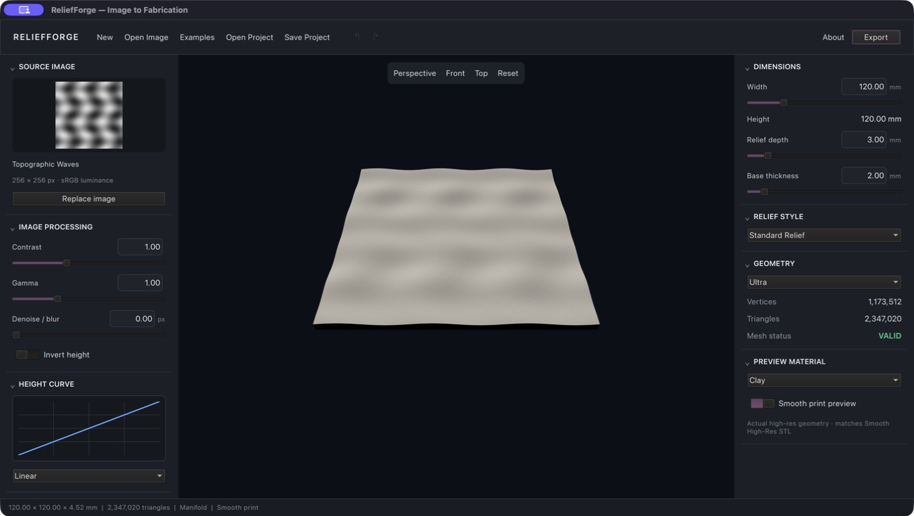
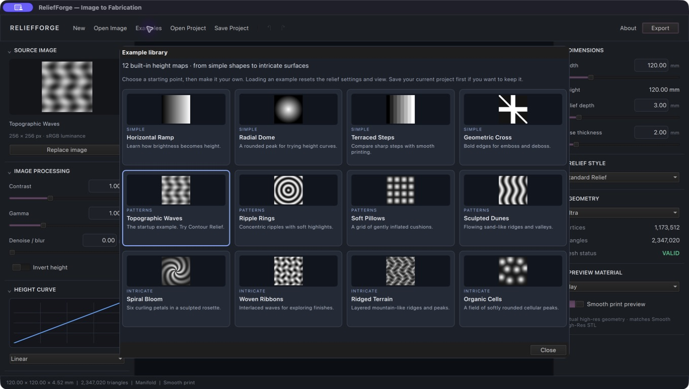

# ReliefForge

ReliefForge is a native C++20/Qt 6 image-to-fabrication application. It treats a non-destructive scalar height field as the canonical model, then generates a watertight mesh for STL, a fitted OpenCascade B-rep solid for STEP, and real paths/polylines for SVG and DXF.

ReliefForge 1.0.0 is free and open-source under [GNU GPLv3](LICENSE), with the full licence in [COPYING](COPYING). Each successfully submitted image shows a small, dismissible creator-support toast with the project's [Buy Me a Coffee and social links](CREDITS.md); it never blocks processing or export.



## Download the Mac app

Open this repository's **Releases** page and download `ReliefForge-1.0.0-macOS-arm64.dmg`. Drag the app to Applications. The packaged build requires **Apple Silicon and macOS 26 or later**; no Homebrew or developer tools are needed to run it. It is ad-hoc signed, not Apple-notarized. See [installation notes](docs/INSTALL_MAC.md).

Developers can download both the application-source ZIP and the dependency-source TAR.GZ from the same release. See [corresponding source](CORRESPONDING_SOURCE.md) and [build/packaging instructions](docs/BUILDING_RELEASE.md). The detailed release page and screenshots are in [version 1 release notes](docs/RELEASE-1.0.0.md).

## Preview and printing

On a normal launch, **Topographic Waves** opens automatically, ready to edit and export. An explicitly opened image or project takes priority. The **Examples** button opens an offline library of 12 original procedural height maps: Horizontal Ramp, Radial Dome, Terraced Steps, Geometric Cross, Topographic Waves, Ripple Rings, Soft Pillows, Sculpted Dunes, Spiral Bloom, Woven Ribbons, Ridged Terrain and Organic Cells.

Each example starts a fresh relief with the standard zero-blur, Ultra, Linear, Clay and smooth-preview settings; the picker reminds you to save the current project before replacing it. All controls and exports work normally. Example-based projects remember a stable bundled-image reference, so they reopen even after the project file is moved. The checked-in assets can be regenerated with `python3 scripts/generate_examples.py` using only the standard library.



Version 1.0.0 starts with **zero blur** and **Ultra geometry**. The height-curve
graph plots the actual mapping (including curves reopened from projects), mesh
counts remain fully written out with locale-aware grouping, and all seven
preview materials now change the rendered color and finish immediately.
Materials are preview-only; they never change exported geometry. Reopened
projects keep their saved processing and resolution settings.

There are two explicit STL print paths: **Smooth High-Res STL** and
**Original Geometry STL**. The **Smooth print preview** switch now displays the
same immutable high-resolution mesh that the smooth STL writer uses, rather
than just smoothing the lighting of the original mesh. Turn it off to inspect
the unchanged original mesh. Vertex/triangle counts follow the selected mode;
both export choices remain available regardless of that switch.

The smooth mesh uses clamped bicubic interpolation of the canonical height
field, preserving the physical footprint, original sample heights, height
bounds, and watertight base. Integer subdivision normally gives 512–1024 samples
along the longest edge (a 256 × 256 field becomes 766 × 766). Already-dense
source fields are retained without further subdivision or silent downsampling.
It does not recover detail absent from the source image. STEP/SVG/DXF continue
to use the original height field. Preview and STL positions use the same float
conversion; STL carries geometry, not the preview's material or lighting.

The repository currently delivers a working vertical slice rather than claiming that all 68 product-brief sections are finished. Raster-to-height processing, physical dimensions, watertight rectangular relief generation, mesh validation, binary/ASCII STL, contour/outline SVG and DXF, versioned projects, a shared CLI, a polished QML shell, and the OpenCascade STEP implementation are present. The feature matrix below distinguishes built functionality from the remaining product roadmap.

## Quick start: portable core and CLI

The portable core has no third-party dependency. The fallback CLI reads PGM P2/P5 images, which makes geometry and exporter regression testing possible on a clean machine.

```sh
cmake -S . -B build -DRELIEFFORGE_BUILD_DESKTOP=OFF -DRELIEFFORGE_BUILD_STEP=OFF
cmake --build build --parallel
ctest --test-dir build --output-on-failure
python3 scripts/generate_examples.py
./build/reliefforge-cli examples/radial-dome.pgm \
  --width 100 --relief-depth 3 --base 2 --samples 256 \
  --export-stl radial-dome.stl \
  --export-svg radial-contours.svg \
  --export-dxf radial-contours.dxf
```

## Desktop dependencies

- CMake 3.24+
- A C++20 compiler
- Qt 6.5+ with Core, Gui, QML, Quick, Quick Controls 2, Quick 3D, and Concurrent
- OpenCascade Technology (OCCT) for genuine STEP output

OpenCV remains an intended image-processing backend for the advanced filter stack. The current processing core is deliberately dependency-free and implements luminance, levels, brightness, contrast, gamma, inversion, Gaussian smoothing, resampling, and edge/contour relief modes directly.

### macOS

With Homebrew dependencies installed:

```sh
brew install cmake qt opencascade ninja
cmake -S . -B build-native -G Ninja \
  -DCMAKE_PREFIX_PATH="$(brew --prefix qt);$(brew --prefix opencascade)"
cmake --build build-native
ctest --test-dir build-native --output-on-failure
./build-native/ReliefForge.app/Contents/MacOS/ReliefForge
```

The application uses Qt's high-DPI support and the Qt rendering abstraction, so the same QML and Quick 3D viewport can target Metal on macOS and the platform-appropriate backend elsewhere.

### Windows

Install Qt 6.5+ and OCCT, then point `CMAKE_PREFIX_PATH` at both package roots:

```powershell
cmake -S . -B build -G Ninja `
  -DCMAKE_PREFIX_PATH="C:/Qt/6.8.0/msvc2022_64;C:/occt"
cmake --build build
ctest --test-dir build --output-on-failure
```

### Linux

Install Qt 6 development packages and OCCT development packages using the distribution package manager, then run the standard CMake commands. Package names vary by distribution.

## Interface

The desktop UI includes:

- a restrained professional dark theme with a large interactive Quick 3D relief viewport;
- drag-and-drop and file-dialog image loading through Qt's format plugins;
- live contrast, gamma, smoothing, inversion, width, depth, and base controls;
- background rebuilds with revision-based cancellation of obsolete results;
- physical size and mesh-health status;
- switchable original and high-resolution smooth print geometry with matching STL export;
- separate original/smooth STL, STEP, SVG, DXF, and project-save actions;
- an accurate live height-curve graph, including loaded custom curves;
- empty state, source thumbnail, collapsible inspectors, studio lighting, and seven material finishes.

Qt image plugins give the desktop app PNG, JPEG, TIFF, BMP, and WebP support when those plugins are present. The CLI's small PGM reader is intentionally not a replacement for the desktop decoder.

## Project structure

```text
src/core/       images, processing, height curves, height fields, mesh, projects
src/export/     STL and vector contour/outline exporters
src/cad/        OpenCascade B-spline fitting, shell/solid validation, STEP writer
src/app/        Qt controller, Quick 3D geometry bridge, CLI, QML interface
tests/          deterministic image, geometry, vector, format, and project tests
scripts/        procedural test-asset generation
docs/           architecture and format notes
```

## Functional status

| Area | Status |
|---|---|
| Luminance, levels, contrast, gamma, invert, blur, resampling | Implemented |
| Linear/editable curve data model and curated curves | Implemented in core; interactive point editor pending |
| Standard, inverted, bas/high, lithophane, emboss/deboss, engraving, contour, edge mapping | Implemented and wired to the desktop inspector |
| Exact width, aspect-derived height, relief depth, base thickness | Implemented |
| Selectable draft/medium/high/ultra/source/custom sampling | Implemented in core |
| Closed indexed solid and manifold validation | Implemented and tested |
| Binary/ASCII STL; matched high-res smooth and original-geometry print paths | Implemented and tested |
| Marching-squares contours, path joining, RDP simplification | Implemented and tested |
| SVG paths and layered DXF LWPOLYLINE entities | Implemented and tested |
| OCCT B-spline surface fitting, sewing, solid validation, AP242 STEP | Implemented; write/read round trip validated with OCCT 7.9.3 |
| Versioned editable project serialization | Implemented and tested; UI reopen flow pending |
| Async Quick 3D preview | Implemented; Qt 6.11 native build and QML runtime load validated on macOS |
| Masks, brush painting, non-rectangular bases, bevels/borders | Roadmap |
| Adaptive tessellation and mesh decimation | Roadmap |
| Full undo/redo command stack, autosave/recovery | Roadmap |
| Advanced CAD patch adaptation and cross-CAD validation matrix | Roadmap |
| Self-contained Apple-silicon macOS ZIP/DMG and ad-hoc signing | Implemented; Developer ID signing and notarisation pending |

## Testing

The test suite creates synthetic flat, gradient, ramp, and non-uniform fields in memory. It verifies processing values, physical dimensions, signed volume, watertightness, manifoldness, triangle counts, contour extraction, binary STL record length, SVG structure, native DXF entities, and project schema round trips. Native Qt tests additionally verify shared-mesh preview switching and exact equality of every rendered triangle position with the corresponding binary STL coordinate in both modes. Controller regressions cover desktop defaults, exact curve samples and custom-project restoration, full-range 64-bit count formatting, and independent material selection.

STEP tests are enabled whenever OCCT is found. They write an AP242 file, assert a native advanced B-rep representation and model name, read the file back through OpenCascade, transfer its roots, and validate the recovered shape. A broader downstream matrix across Fusion, SolidWorks, FreeCAD, Rhino, Inventor, and Onshape remains release work.

## Known limitations

- The first production slice uses a rectangular base. Silhouette, circular, oval, custom-vector, border, bevel, and chamfer solids are not yet implemented.
- SVG/DXF currently export iso-height contours or the model boundary. Colour-range vectorisation and engraving centrelines are later work.
- STEP uses a single fitted B-spline surface. The planned adaptive patch fitter is needed for very large or discontinuous reliefs.
- The QML shell exposes the primary adjustment workflow. Several visible advanced selectors are presentation-ready but not wired until their command/undo semantics are in place.
- Project image embedding, masks, camera/UI persistence, recent files, autosave, and recovery are not complete.

See [ARCHITECTURE.md](ARCHITECTURE.md) and [FORMATS.md](FORMATS.md) for implementation details.

## Licence and credits

ReliefForge 1.0.0 is released under [GNU GPLv3](LICENSE). Creator links are collected in [CREDITS.md](CREDITS.md), and bundled dependency information is recorded in [THIRD_PARTY_NOTICES.md](THIRD_PARTY_NOTICES.md). Both application and dependency source archives must accompany public binary downloads; see [CORRESPONDING_SOURCE.md](CORRESPONDING_SOURCE.md). The **About** panel displays the licence, warranty notice, credits and source directions. Your imported images and exported relief files are not relicensed by merely using this app.
